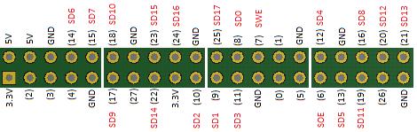

# Drive WS281x ledstrips with 16 parallel channels on a Raspberry with NodeJS

Used by [Ledder](https://github.com/psy0rz/ledder)

This uses the Secondary Memory Interface (SMI) that all the Rapsberry PI's have.

It supports 16 parallel channels, with up to 450 leds per channel.

Its based on the excellent ideas and code of Jeremy P Bentham.

Look at https://iosoft.blog/2020/09/29/raspberry-pi-multi-channel-ws2812/ for the technical details.

The code this is based on: https://github.com/jbentham/rpi .

## My test configuration:

 * Rapsberry Zero W 2
 * Using Rapsberry PI OS Lite 32-bit. (Debian bookworm/12)
 * NodeJS 18
 * WS2812 ledmatrixes with 8x32 pixels per matrix. (and 8 of those matrixes parallel)

Updating 8 x 8 x 32 leds at 60fps from nodejs uses around 18% CPU which it pretty amazing! (this probably even could be optmized)

## How to

### 1. Flash Rapsberry PI OS Lite 32-bit. (Debian bookworm/12) on your SDcard.

Make sure to use a **32-bit** OS.

Use rpi-imager to make this easier: <https://www.raspberrypi.com/software/>

### 2. Disable audio drivers

Important, the audio drivers conflicts, so you will get glitches if its enabled.

To disable them, create a file /etc/modprobe.d/blacklist-ws281x.conf with:
```
blacklist snd_bcm2835
blacklist snd_pcm
blacklist snd_timer
blacklist snd_pcsp
blacklist snd
blacklist snd_soc_core
blacklist snd_pcm_dmaengine
blacklist snd_soc_hdmi_codec
blacklist snd_compress
blacklist vc4
```

And run:
```
update-initramfs -u
reboot
```

Confirm that there are no snd modules running with lsmod.

### 2. Install requirements

```
apt update
apt install -y nodejs npm cmake 
```

### 3. Compile 

Compile it, and pay special attention to the device detection:

```console
root@psypi:~/rpi-ws281x-smi# npm i
...
rpi-ws281x-smi: Raspberry device string: Raspberry Pi Zero 2 W Rev 1.0
rpi-ws281x-smi: Configuring as Pi 2 or Pi 3 or Pi Zero 2
...
```

If it doesn't configure for the correct hardware, it wont work.


### 5. Connect led strips to the correct pins

This is the pinout:



### 6. Test

Now test it by running test.js:
```
root@psypi:~/rpi-ws281x-smi# node test.js
```

This should show a sliding RED led on all channels and also show the maximum achievable FPS if you would constantly update all pixels. (16 * 256)

Note that this FPS might be higher than the actual speed of the ws2812 protocol, resulting in frame-skips. This is just to get an indication of the overhead.

If you get lots of glitches, check if the snd drivers are still loaded, and check your wiring.

You also might need level converters from 3v3 to 5v, like a SN74AHCT125N 


### Next

If you want to run cool LED effects, try out https://github.com/psy0rz/ledder


